# BeerExplorer

Beer Explorer is a beer finder application utilizing NodeJS, an Express Web Server & Router, Sequelize ORM, MySQL, and deployed using Heroku. 

The full list of technologies are as follows:

* Axios
* Bcrypt-nodejs
* Body-parser
* BreweryDB API
* Brewerydb-node
* Browserify
* Chai
* CSS3
* Dotenv
* ExpressJS
* Font Awesome
* Heroku
* HTML5
* Karma
* Mocha
* MySQL
* NodeJS
* Passport
* Sequelize
* Sinon
* Supertest
* W3 Schools
* Watchify

USER LOGIN

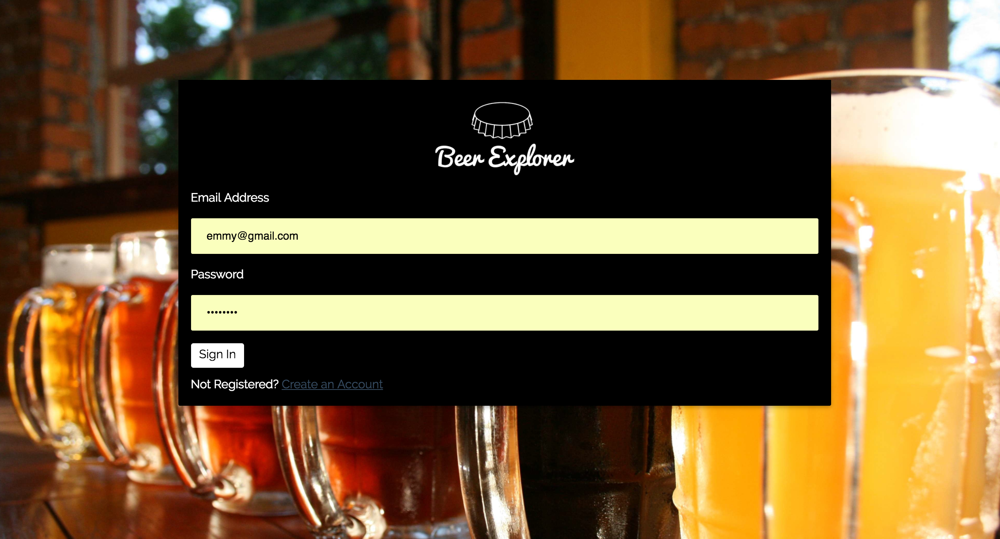

Beer Explorer is wrapped -- from every REST endpoint in the UI to the DB -- in a secure user authentication provided by the NodeJS packages, BCrypt and Passport. User is prompted to sign up if they cannot sign-in. 

As the dashboard demonstrates, Beer Explorer allows user to search for beer in both a catalogue and a randomized wheel. User can also create reviews on beer, as well as reference, revise, and delete previous beer ratings.

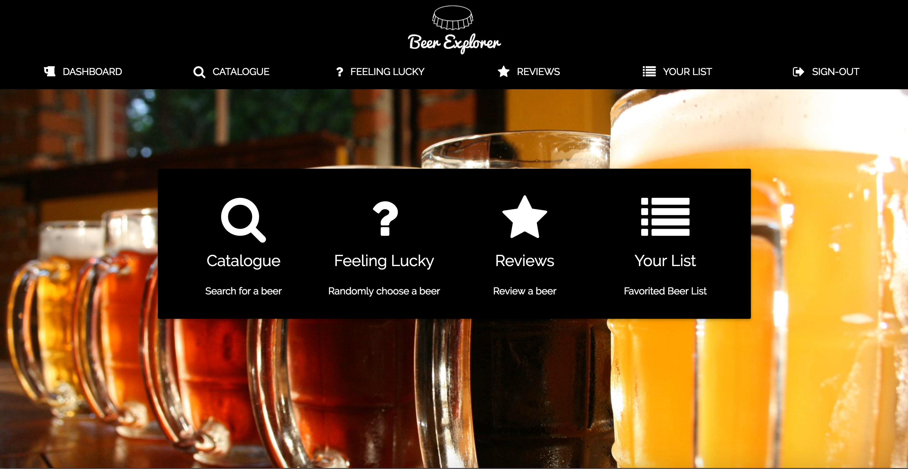

The following features are included.

I.  CATALOGUE

On pageload, a dropdown list appears and forces user input. 

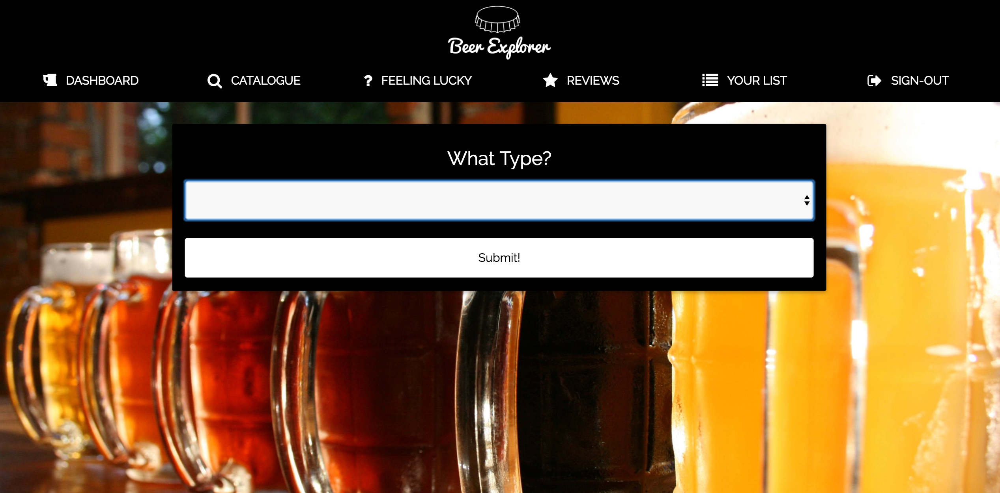

The user selects from a list of popular beer types and submits their selection. 

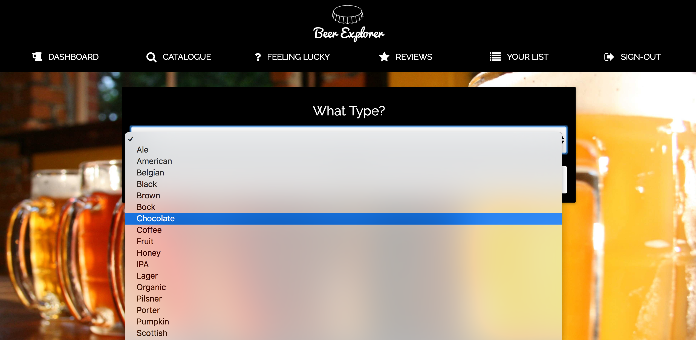

After receiving response from the BreweryDB API, the user sees an appended list of buttons with brewery name and beer name on them. Each button is given a unique ID that corresponds with its ID in the BreweryDB API. 

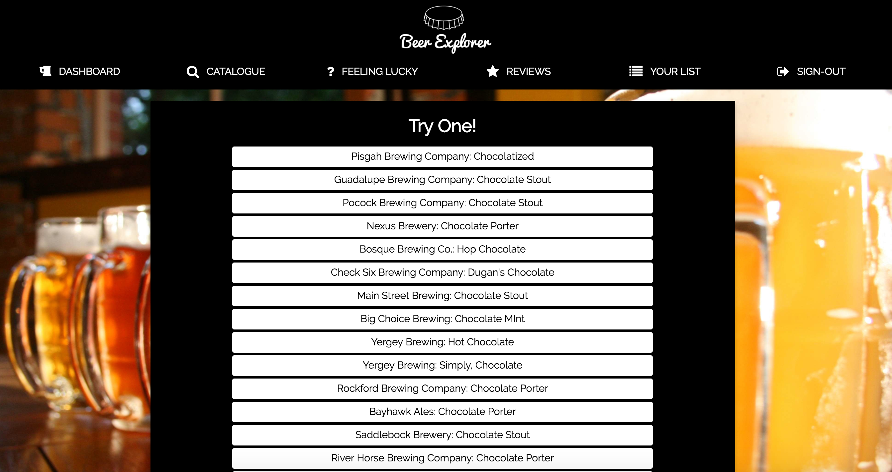

On the click of the button, another call is made to the db, with the search parameter being that unique ID. The response is shown in a modal, and the user sees an image for the brewery that makes the beer, as well as a description of the beer. 

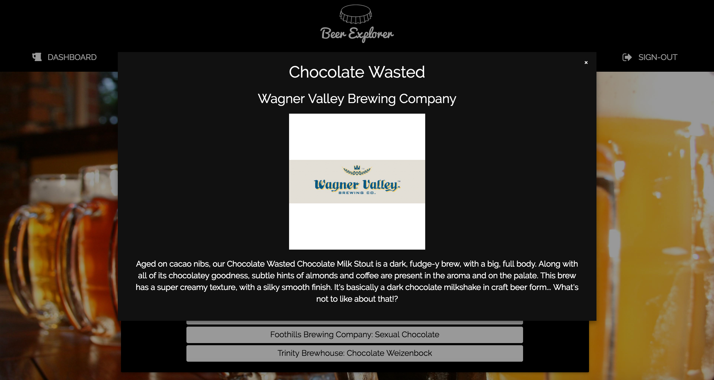

II. FEELING LUCKY

On pageload, a colorful wheel appears with a different popular beer types in each of the 8 different fractions of the wheel. On the left side of the wheel, a button allows the user to hit "SPIN" for the wheel. 

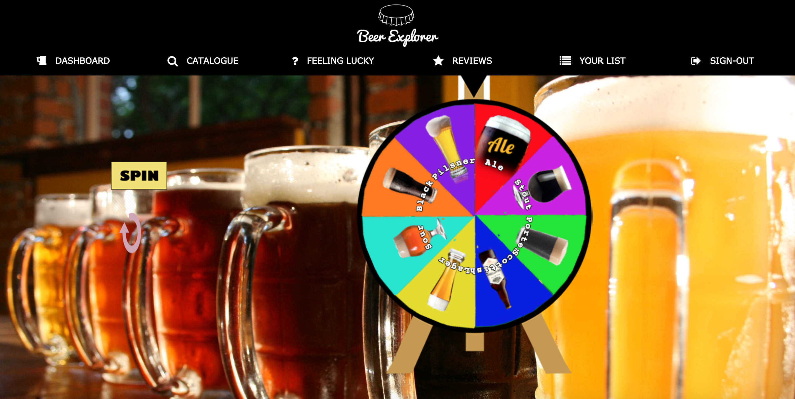

Once the wheel stops, there is an alert that suggests a beer type for a user to input into the catalogue.

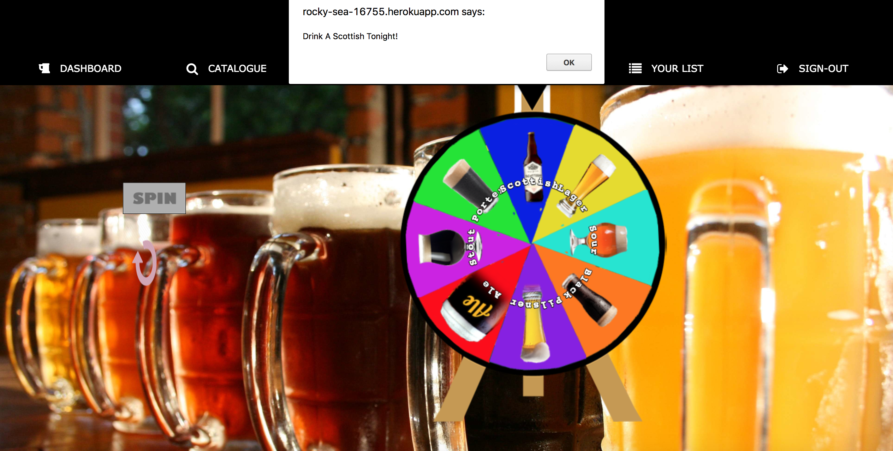

III. REVIEWS

On pageload, a form appears asking the user to input 7 different parameters:

* Beer Name
* Type
* Clarity
* Hue
* International Bitterness Units
* Bubble Size
* Head

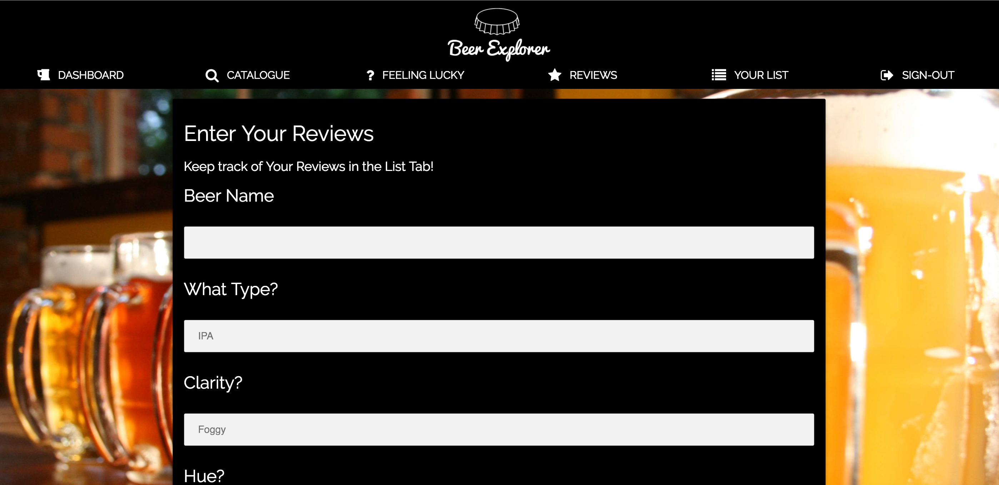

The 8th parameter is the user_rating.

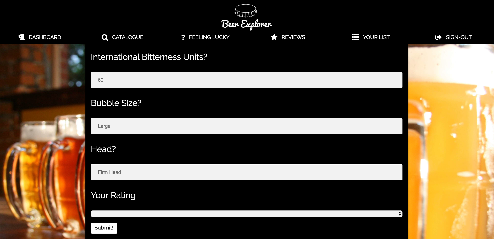

Both of these parameter groups write into the same database, beer_db, however, they write to separate parts of the db. Params 1-7 write to the Beers table whereas the user_rating writes to the Ratings table.

The user is forced to fill out all the parameter fields. On submit, both the beer info and the user rating populate to the List page, and are stored in the MySQL join table, Ratings.

IV. LIST

On pageload, the List has the full CRUD capabilities for user to: Create, Read, Update, and Delete their own beer ratings.

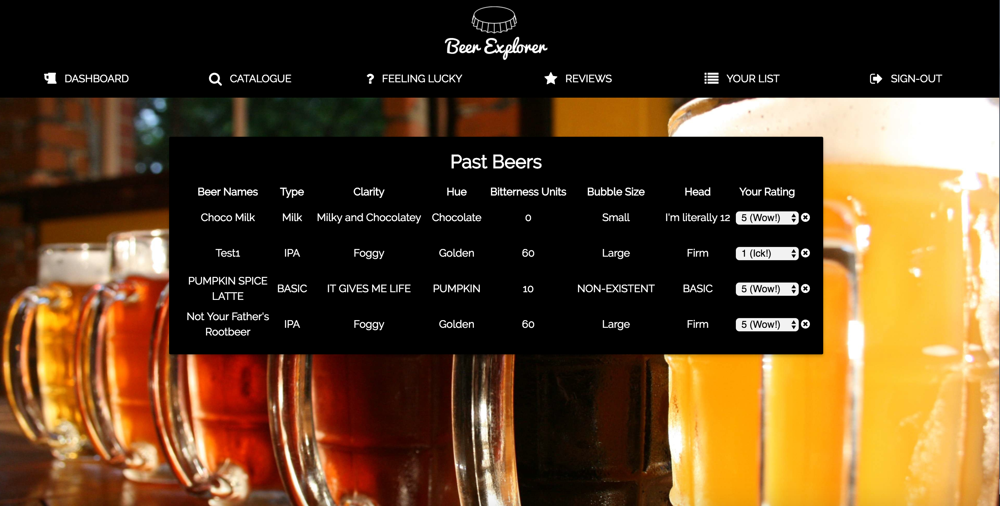

This list is permanently stored to the mysql db for each individual user until the user decides to do a CRUD action to the data.

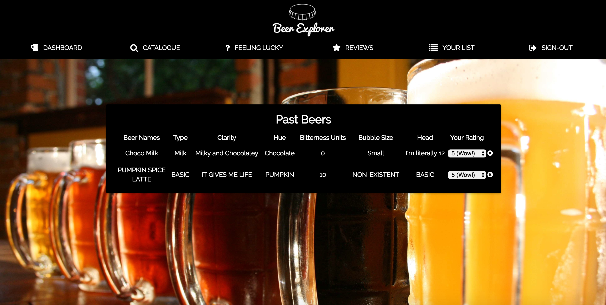

User may select to logout.

